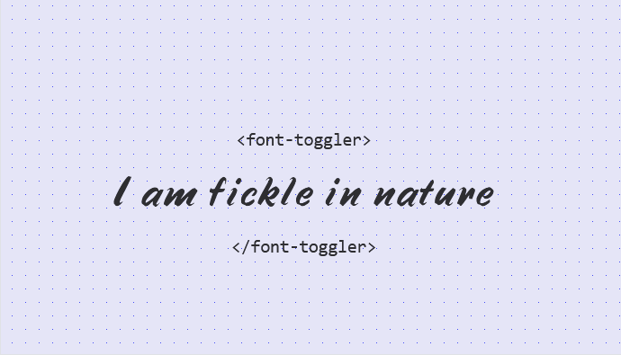

# Font Toggler

A web component to toggle the font of elements inside it. [Demo](https://alifeee.co.uk/font-toggler/).



## How to use

### Create font stylesheet

Create a stylesheet for the fonts, with the format the same as [`fonts.css`](./fonts/fonts.css).

To make this easier, I use [this bash script](https://gist.github.com/alifeee/8607c787a0c60684827b5f07bbb95a5d) to convert filenames to CSS.

```css
/* ... */
@font-face {
  font-family: "Windsong";
  src: url("./1 - Handwriting/Windsong/Windsong.woff") format(woff);
}
.font--windsong {
  font-family: "Windsong" !important;
}
/* ... */
```

### Use web component

Include the web component script and font stylesheet in your `<head>`.

Wrap a component to change the font of, specifying the filename of the stylesheet, and the time between font switches, in seconds.

```html
<link rel="stylesheet" href="fonts/fonts.css">
<script src="./font-toggler.js"></script>
<!-- ... -->
<font-toggler stylesheet="fonts.css" every_s="10">
    <p>I want this text to change!</p>
</font-toggler>
```
